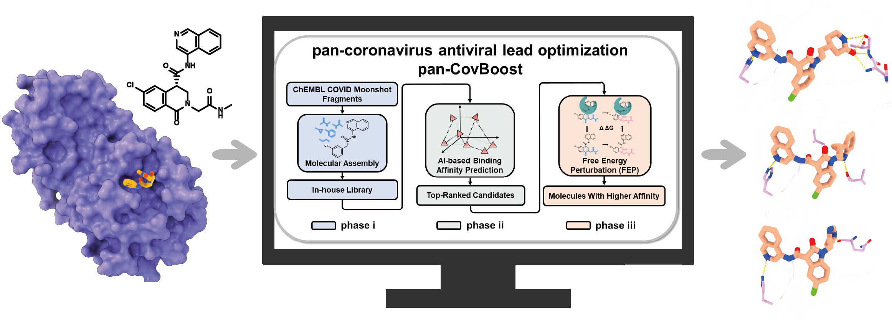

# Deep-CovBoost：Integrating physics-based simulations with data-driven deep learning represents a robust strategy for developing inhibitors targeting the main protease

## Molecular Assembly

## AI-based Binding Affinity Prediction

## Free Energy Perturbation (FEP) 
程序主体见FEP文件夹。  
（1）小分子mol2文件准备。准备FEP计算所需的A状态和B状态的小分子配体mol2文件。  
（2）小分子力场文件准备。将上述A和B两个状态的小分子mol2文件使用 CHARMM-GUI 的 Ligand Reader & Modeler 模块生成力场文件。  
（3）FEP计算文件准备。基于上述力场文件使用 [FEPMolSetup.py](FEP/FEPMolSetup.py) 生成FEP计算所需文件。
（4）提交FEP计算。使用上述生成的运行脚本提交FEP计算即可。  