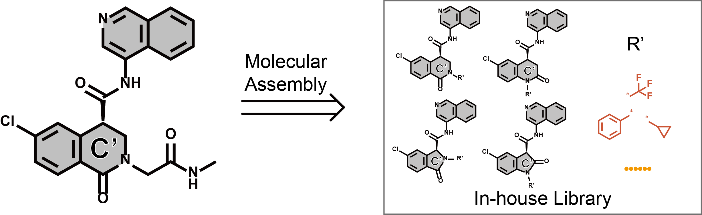
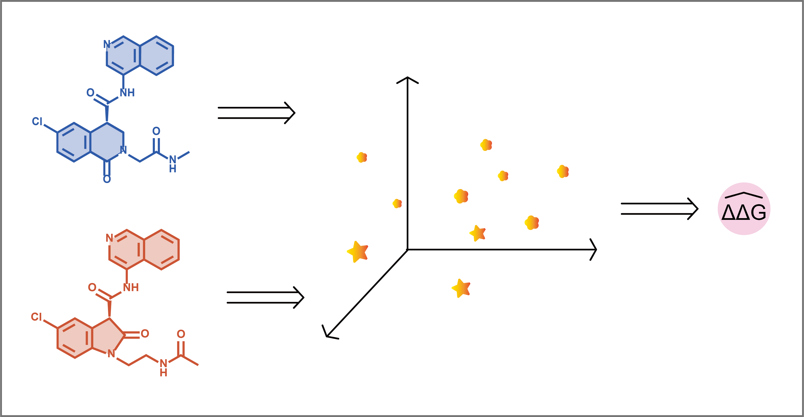
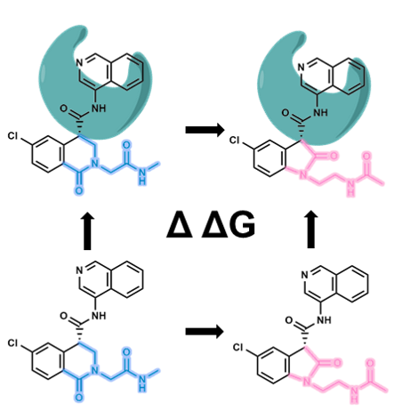

# Deep-CovBoost：Integrating physics-based simulations with data-driven deep learning represents a robust strategy for developing inhibitors targeting the main protease

## Molecular Assembly

  

**(1) Molecular fragmentation protocol.**  
Execute molecular fragmentation of SMILES using
[GenerateFragments.py](GenMol/GenerateFragments.py). Process molecular fragments with [FragmentDict.py](GenMol/FragmentDict.py).  

**(2) Generate in-house library.**  
Generate novel compound libraries by assembling lead compound scaffolds with molecular fragments using [GenMolLibrary.py](GenMol/GenMolLibrary.py).  

## AI-based Binding Affinity Prediction

  

**(1) Data preparation.**  
[DataSplit.py](PredAffinity/DataSplit.py) normalizes input data and generates five-fold cross-validation input data.  

**(2) Five-fold cross-validation.**  
[DDGmpnnTrain.py](PredAffinity/DDGmpnnTrain.py) performs five-fold cross-validation.  

**(3) Prediction.​**  
[DDGmpnnPredict.py](PredAffinity/DDGmpnnPredict.py) performs prediction.  

## Free Energy Perturbation (FEP) 

  

**​​(1) Prepare input files.​​**  
Prepare mol2 files of the ligand molecules representing State A and State B for FEP calculations. Use CHARMM-GUI's ​Ligand Reader & Modeler module​ to generate force field parameters for both ligand mol2 files.  

**(2) Generate dual-topology file.**  
Use [FEPMolSetup.py](FEP/FEPMolSetup.py) to create the dual-topology file required for FEP calculations.  

**(3) Run FEP calculation.​** 
